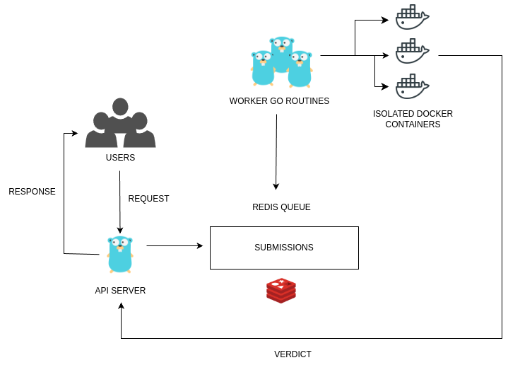

# Online Judge

An implementation of an online judge. It allows users to submit code solutions, which are compiled and run inside isolated Docker containers. Outputs are compared against test cases to determine verdicts such as `Accepted`, `Wrong Answer`, or `Time Limit Exceeded`.


---

## Architecture



## Features

- REST API to submit and query code submissions  
- Secure Docker containers for sandboxed code execution  
- Custom judging logic (compile, run, compare I/O)  
- Redis-based job queue for asynchronous processing  
- Parallel execution of submissions  
- Test case comparison and verdict generation  
- Dockerized services for portability and isolation  

---

## Tech Stack

| Component         | Technology         |
|------------------|--------------------|
| Backend API       | Go (`gin`)         |
| Task Queue        | Redis              |
| Containerization  | Docker             |
| Job Worker        | Go goroutines      |
| Code Execution    | Isolated Docker containers |


---

## Setup Instructions

Follow these steps to set up and run the Online Judge locally:
### 1. Start Redis Server

Make sure Redis is installed and running using Docker:

```bash
docker run -d --name redis -p 6379:6379 redis
```

### 2. Run the Go Server

Start the judge server:

```bash
go run cmd/judge/main.go
```

The server will be available at `http://localhost:8080`

### 3. Build Docker Images

Build the Docker images that will compile and execute submitted code. All Docker images are stored in the `internal/docker/` directory.

```bash

cd internal/docker/
```

### 4. Prepare and Submit Code

#### Create a Submission Request

Create a file named `submission.json` with the following structure:

```json
{
  "id": "sub1",
  "code": "",
  "language": "cpp",
  "problem_id": "1"
}
```

#### Send the Submission

Use curl to send the request to the `/submit` endpoint:

```bash
curl -X POST http://localhost:8080/submit \
  -H "Content-Type: application/json" \
  -d @submission.json
```

### 5. Add Test Cases

Test cases should be organized in the following folder structure:

```
testcases/
└── 1/
    ├── input.txt
    └── expected.txt
```

Replace `1` with the appropriate problem ID.


## API Endpoints

- `POST /submit` - Submit code for judgment


